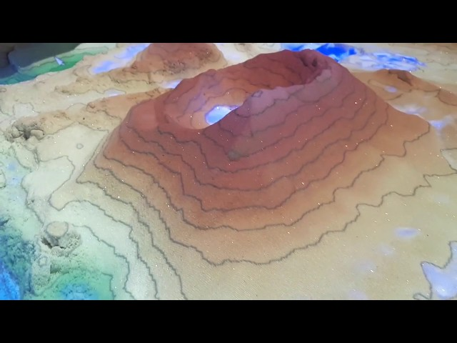
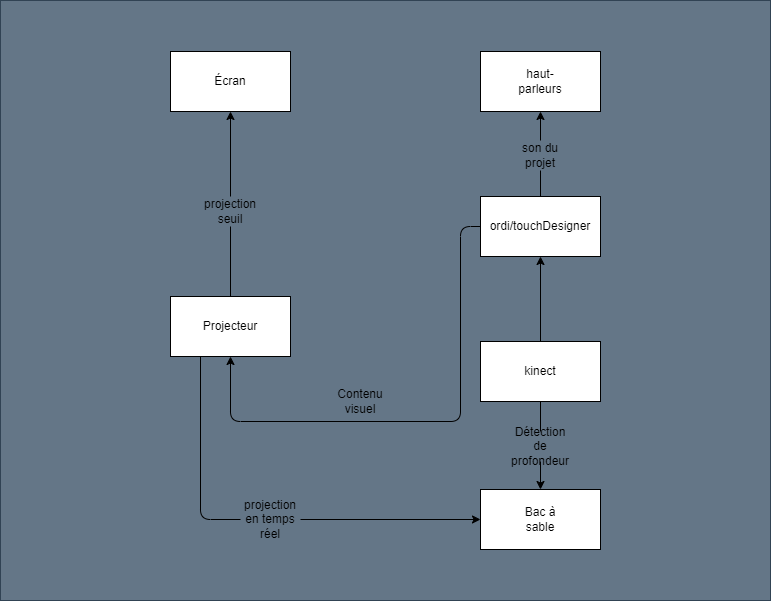
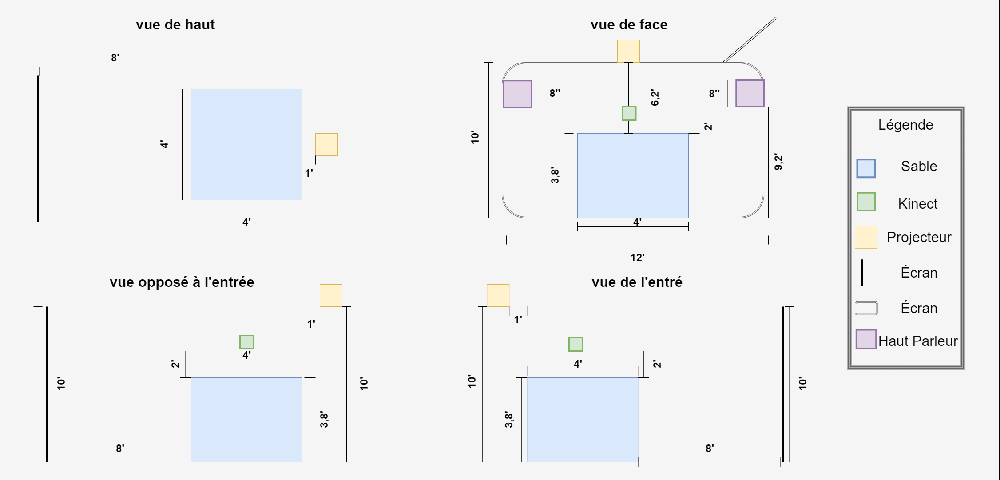
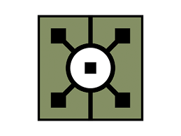

# Paysage en Souffrance
|  |  |
|-------|-------|

### idée

Bac à sable interactif qui refète l'état de l'éco-systhème planétaire.

### objectif

Sensibiliser les interacteurs(trices) aux conséquences de l'excavation.

### Concept

Les interacteurs(trices) se regrouperont autour du bac à sable et pourront intéragir  

avec la topographie du paysage insi qu'avec l'éco-systhème. Chaque modification influencera

la projection visuel de la terre. Il s'agira de trouver une balance entre nature et profit.

## [Référence bac à sable](https://journals.openedition.org/mappemonde/7890)

### shémat d'interaction

 

### Synopsis

 

### Plantation

L'oeuvre doit pouvoir être interactif sur 360°. Afin que les participants puisse modifier le contenu du bac à sable de tout les côtés,
l'oeuvre sera distenciée de la surface de projection de huit pieds. Le projecteur sera attaché au plafond afin de ne pas aveuglé les interacteur(trice)s.
Les haut parleurs seront stéréo et donc placés de chaque côté de la surface de projection. La kinect sera positionnée à deux pieds du dessu du bac à sable
pour que personne ne se frappe. Finalement les dimentions du bac à sable sont de 4'x 4'x 3,8' afin d'accueillir une bonne quntité de personne et de faire en sorte
que les gens n'éprouvent pas des difficultés à intéragir.

### liste d'équipement

L'artiste s'occupe de la construction du bac à sable et de la quantité de sable placé à l'intéreur afin de s'assurer que les données envoyé au logiciel soit précises.
l'ordinateur avec le logiciel touch designer est également fournis par l'artiste pour facilité l'instalation de l'oeuvre. La kenect sera fournis par l'artiste, car celui-ci
sera attelé au dessus du bac à sable. Le reste est pris en charge par le lieu d'exposition.

| Équipement de l'artiste | Équipement pise en charge par le lieu d'exposition |
| :---: | :---: |
| Ordinateur | Projecteur |
| Bac à Sable | Haut Parleurs |
| Sable | Câblage |
| Kinect | Surface de Projection |

### Logiciel utilisé

|  | <b>TouchDesigner</b> |
| :---: | :---: |

Le logiciel TouchDesigner est assez polyvalent pour regrouper l'analyse des données kinects aisi que le changement visuel et sonore 
désiré avec la detection de seuil.

### autre

Les ambiances sonores seront créés d'avance avec le logiciel Reaper et ne seront modifiés d'aucune façon lors de l'interaction avec l'oeuvre.

