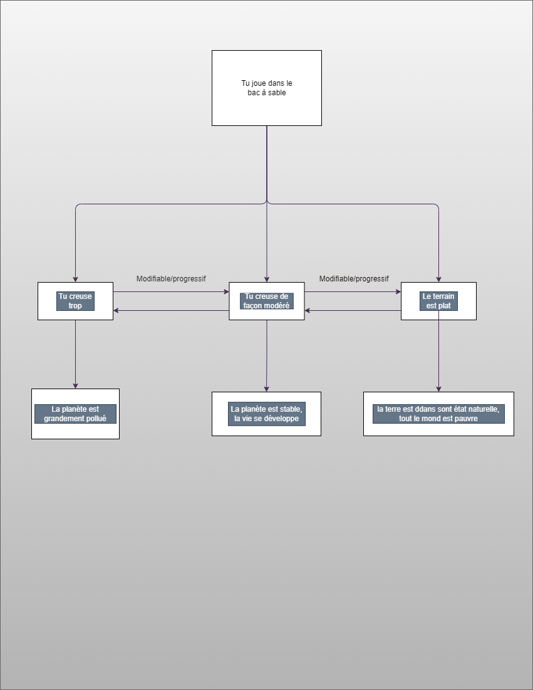
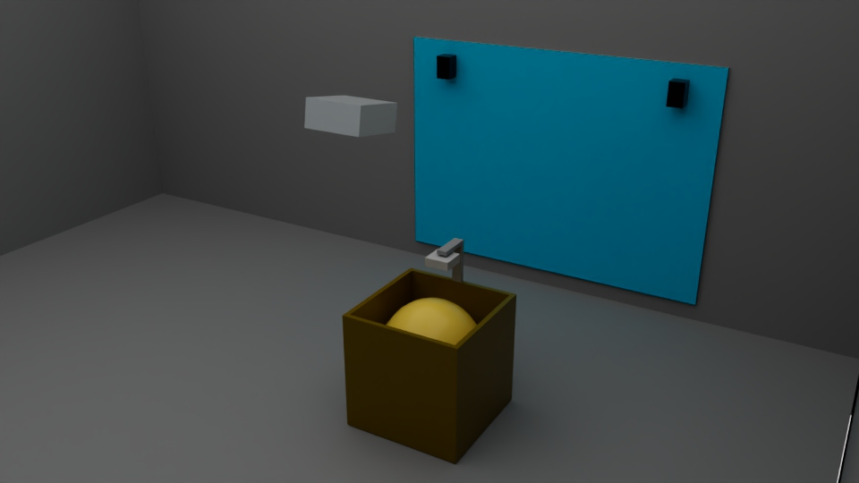
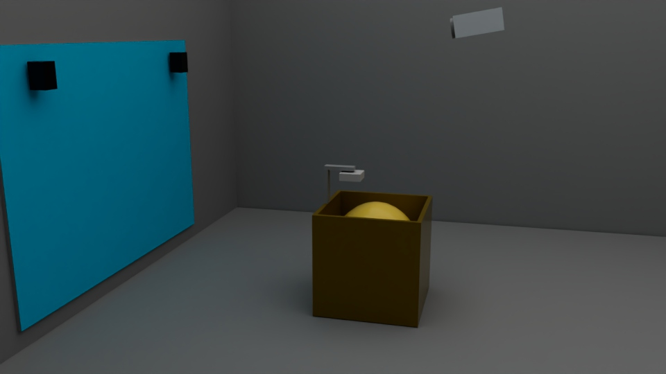
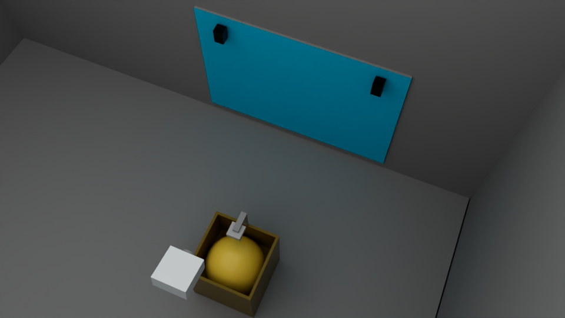
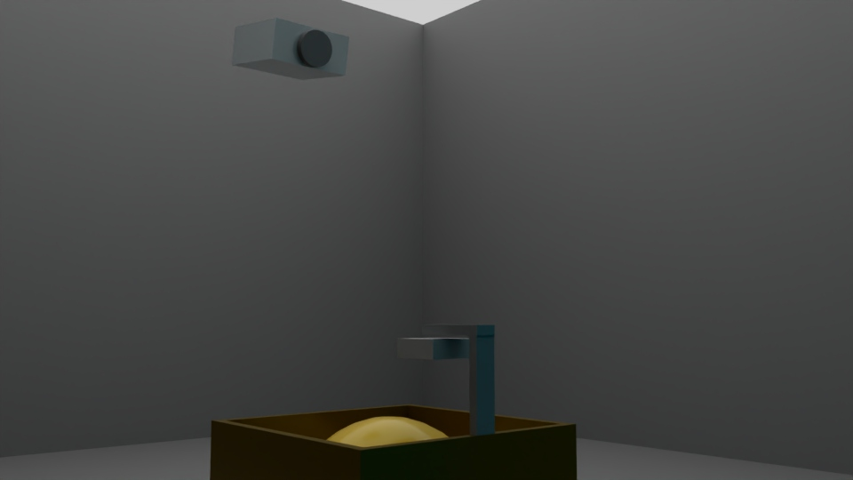

# Développement durable

### inspiration

  

|  |  |
|-------|-------|

## [Référence bac à sable](https://journals.openedition.org/mappemonde/7890)

  

### idée

Bac à sable interactif qui reflète l'état de l'écosystème planétaire.
  

### objectif

Sensibiliser les interacteurs(trices) aux conséquences de l'excavation.
  

### Concept

 

Les interacteurs(trices) se regrouperont autour du bac à sable et pourront interagir  

avec la topographie du paysage ainsi qu'avec l'écosystème. Chaque modification influencera

la projection visuelle de la terre. Il s'agira de trouver une balance entre nature et profit.

  

### schémas d'interaction

 

  

### scénarimage

|  |  |
|-------|-------|

|  |  |
|-------|-------|

  

### Synopsis

 

  

### Plantation

 
L'oeuvre doit pouvoir être interactive sur 360°. Afin que les participants puissent modifier le contenu du bac à sable de tous les côtés,
l'oeuvre sera distanciée de la surface de projection de huit pieds. Le projecteur sera attaché au plafond afin de ne pas aveugler les interacteur(trice)s.
Les haut-parleurs seront stéréo et donc placés de chaque côté de la surface de projection. La kinect sera positionnée à deux pieds du dessus du bac à sable
pour que personne ne se frappe. Finalement les dimensions du bac à sable sont de 4'x 4'x 3,8' afin d'accueillir une bonne quantité de personne et de faire en sorte
que les gens n'éprouvent pas des difficultés à interagir.

  

      

### liste d'équipement

L'artiste s'occupe de la construction du bac à sable et de la quantité de sable placé à l'intérieur afin de s'assurer que les données envoyées au logiciel soient précises.
L’ordinateur avec le logiciel touch designer est également fournis par l'artiste pour facilité l'installation de l'oeuvre. La Kinect sera fournie par l'artiste, car celui-ci
sera attelé au-dessus du bac à sable. Le reste est pris en charge par le lieu d'exposition.

   

| Équipement de l'artiste | Équipement pris en charge par le lieu d'exposition |
| :---: | :---: |
| Ordinateur | Projecteur |
| Bac à Sable | Haut-Parleurs |
| Sable | Câblage |
| Kinect | Surface de Projection |

       

### Logiciel utilisé

|  | <b>TouchDesigner</b> |
| :---: | :---: |

Le logiciel TouchDesigner est assez polyvalent pour regrouper l'analyse des données Kinect ainsi que le changement visuel et sonore 
désiré avec la détection de seuil.

  

### autre

Les ambiances sonores seront créées d'avance avec le logiciel Reaper et ne seront modifiés d'aucune façon lors de l'interaction avec l'oeuvre.

